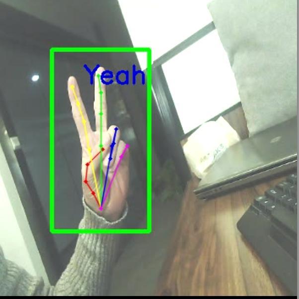

This repository currently implemented the CPM  model using TensorFlow for hand pose estimation. The original source is [here](https://github.com/edvardHua/PoseEstimationForMobile)

I did small changes in the network to train hand pose estimation model.

### Demo
1. Install python packages ([requirements.txt](./requirements.txt))
```Shell
pip install -r requirements.txt
```
2. Compile [MobileNet-Yolo](https://github.com/eric612/MobileNet-YOLO). This is for hand detection. I've trained hand detection caffe model.. Please reference the [MobileNet-Yolo](https://github.com/eric612/MobileNet-YOLO) README file to compile and run the framework. Another option is use your own hand detection method.
3. Run the demo
```Shell
python demo.py
```
Example of result shown in [result.mp4](./result.mp4)



### Training
You should prepare your dataset, and change the path in the hand.cfg file.
```Shell
cd training
python3 src/train.py experiments/hand.cfg
```


### Project is updating............, If you have idea to improve the result please open an issue and share your thoughts 
